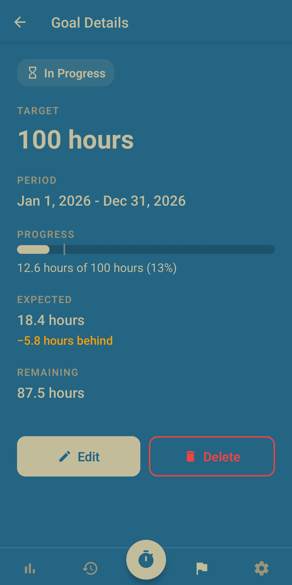
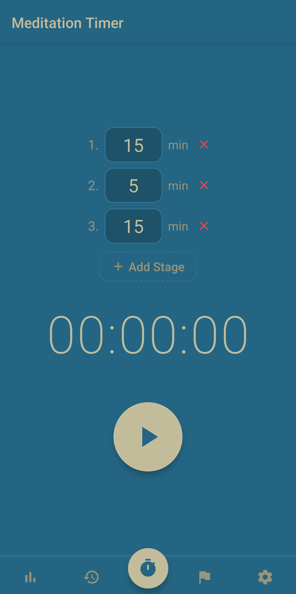
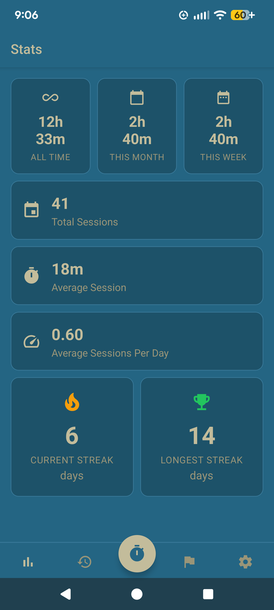

<p style="margin: auto; max-width: 256px;" align="center" width="100%">


</p>

<h1 align="center">Prajna</h1>

A simple Android app for meditation tracking.

Set meditation goals. Work towards them day by day. No soundscapes, no guided sessions. Just this single moment. _Om shāntih shāntih shāntih_.

<p style="margin: auto;" align="center" width="100%">







</p>

What is prajna? It's a Sanskrit word roughly meaning _wisdom_, or _knowledge of the truth_.

> Meditation and wisdom are of one essence and not two.
> Meditation is the body of wisdom, and wisdom is the function of meditation.
> Wherever you find wisdom, you find meditation. And wherever you find meditation, you find wisdom.
>
> _The Platform Sutra_

Features:

- Record your meditation sessions in the app, or enter past sessions manually.
- Create a timer for your meditation, e.g. 20 minutes. Get notified when the timer is done by a singing bowl sound.
- Create multiple stages of timers, e.g. 10 minutes, then 5 minutes, then 10 minutes. Get notified between each stage. Useful for longer sessions where you want to take scheduled breaks.
- Define goals, e.g. "I'll meditate 100 hours this year," and compare your progress against the goal.
- See statistics like total meditation time, streaks, etc.
- Import/Export user data (sessions and goals) as JSON.

Non-features:

- No ads, fees, or distractions.
- No network access (all data is saved locally on your device).
- No guided meditations or other "content."

> [!WARNING]
> This app was written with AI assistance. If that bothers you, don't use it. I understand.

## Installation

Prajna is not distributed on the Google Play Store. To install it, you need to manually download and install the `.apk` file from the [latest release](https://github.com/luketurner/prajna/releases/latest).

## Learn More about Meditation

Meditation can be easy or it can be hard. It can be simple or it can be complicated. It can be physical or it can be mental. It seems like everyone has their own techniques to espouse. What is "true" meditation? That's for you to decide.

If you want to learn more about meditation, consider perusing the following books:

- _Zen Mind, Beginner's Mind_, by Shunryu Suzuki.
- _The Miracle of Mindfulness_, by Thich Nhat Hanh.
- _The Tibetan Book of Living and Dying_, by Sogyal Rinpoche.

## Development

Prajna is written using [React Native](https://reactnative.dev/) and [Expo](https://expo.dev).

```bash

# Run dev server
npm run start

# Development Android build on EAS
eas login
npm run build:develop

# Build an APK
npm run build:preview
```
